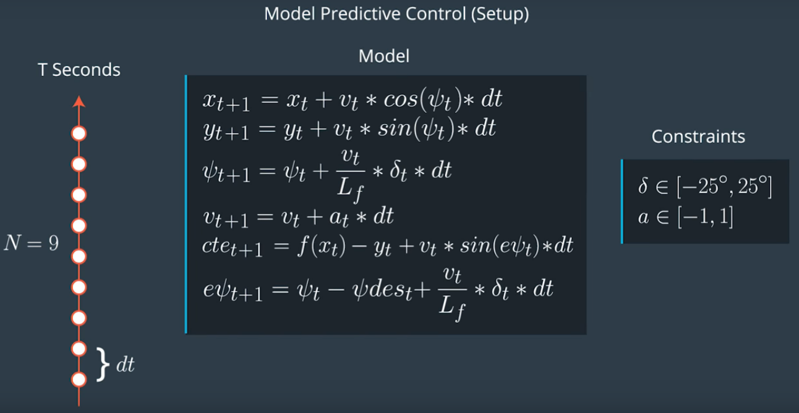
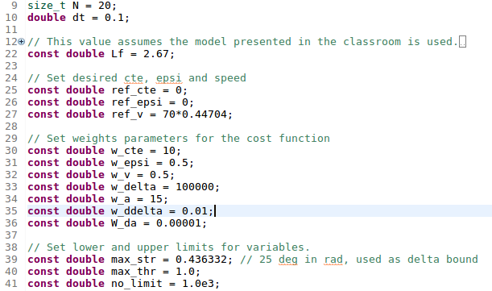

# Term2_Proj5_MPC
Use MPC to drive the vehicle on the track in simulation tool

The target of this project is: use MPC to drive the vehicle safely on the track in simulation tool using C++ (Eclipse IDE).

## Content of source code
- `src` source code directory:
  - `main.cpp` - communicate with simulation tool, call functions to solve MPC and update control parameter steering and acceleration.
  - `MPC.cpp` - feed MPC solver with initial state, constrants and simplified kinematic model, solve the MPC solver to get optimum control input. 

## MPC Model


MPC uses a kinematic model as shown above, the states include x, y coordinates, velocity, psi angle, distance error in y direction and direction error epsi. Steering angle delta and acceleration a are control inputs.

## Curve fitting

The MPC in this project only consider several seconds ahead, normally the road will not change significantly. So 1st order polynomial is used to represent the track.

A very important thing here is to transform global coordinates into car coordinates. The simplified kinematic model can only be used when the track is relatively straight, and driving direction is x-axis. After coordinates tranformed, all these preconditions are met. 

## MPC Parameter tuning


In order to use simplified kinematic model, I prefer to use small dt which can reduce error.
If look too far ahead, the track cannot be represented by 1st order polynormial, so 30 steps are applied.
Other tunable parameters are shown as above pic.

## Latency

Latency problem can be solved by:  run the model for the delay time, then feed updated states into MPC solver. 


## How to run the code
Clone this repo and perform
```
mkdir build && cd build
cmake ../src/  && make
./mpc
```


